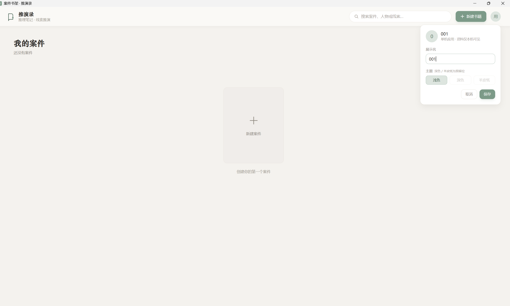
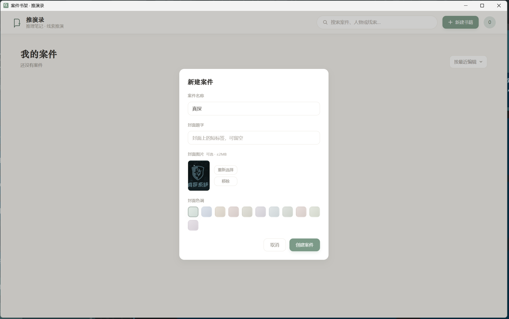
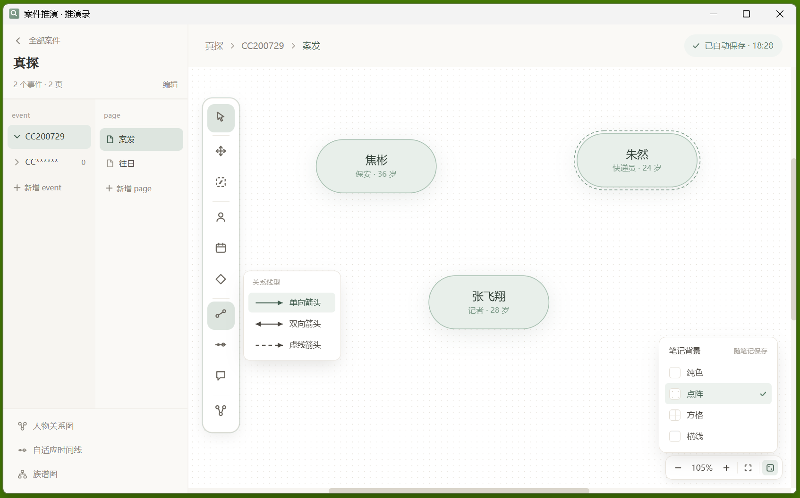
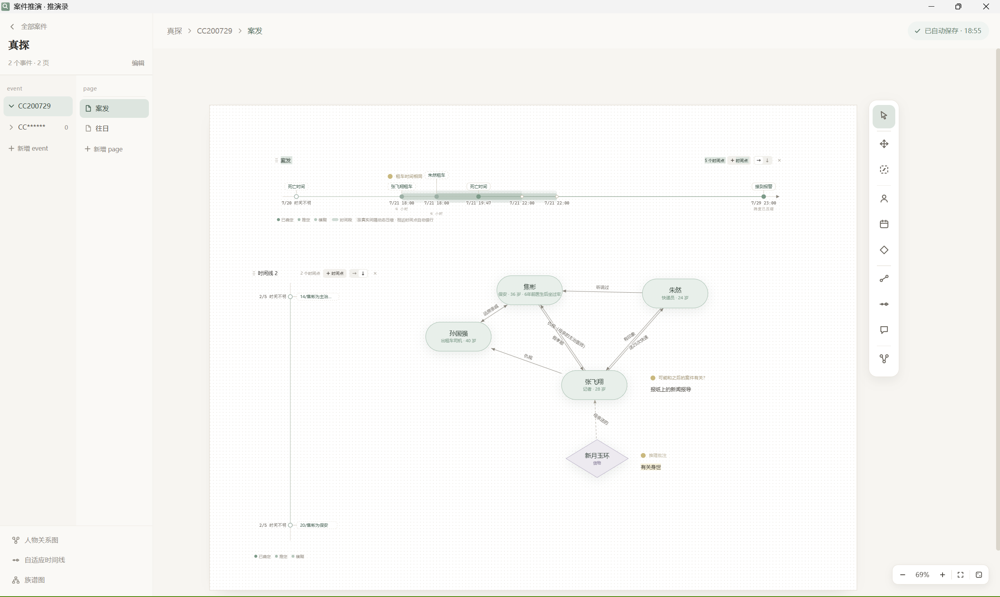
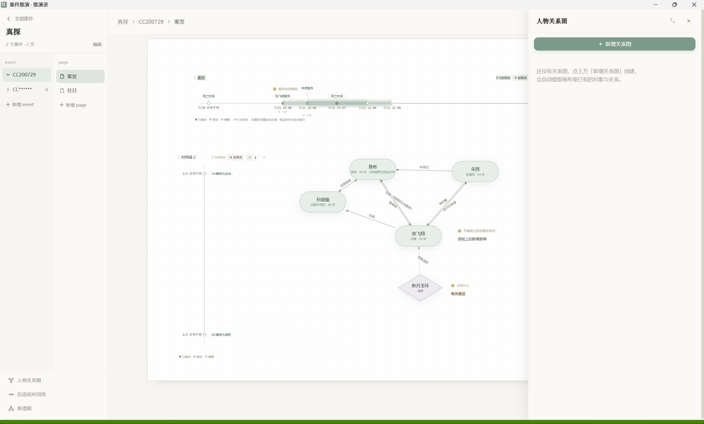
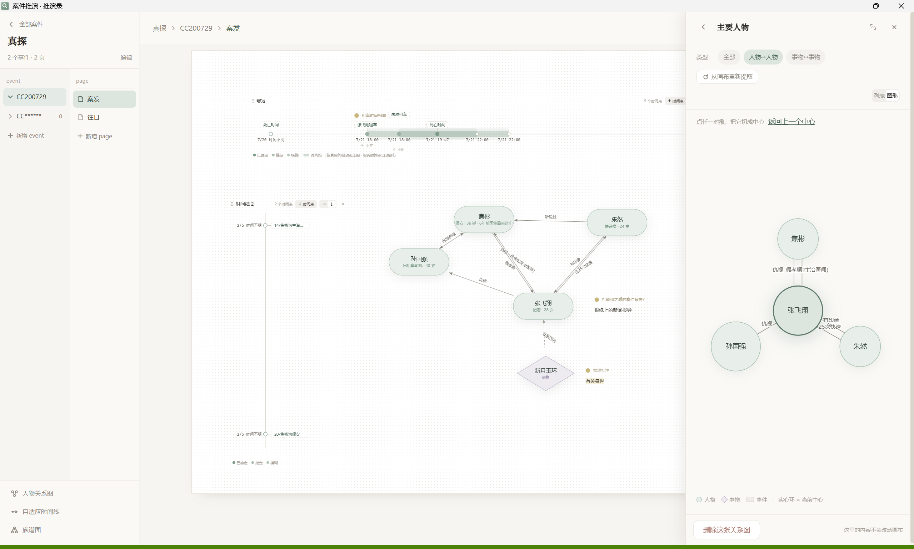
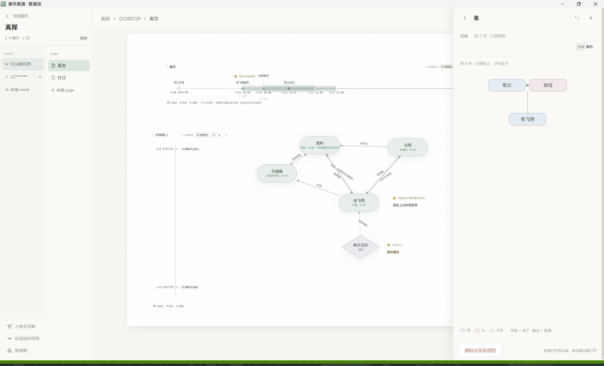

# Detective Helper · 推演录

辅助推理（剧本杀 / 推理本）的单机笔记工具。结构为 **Book → Event → Page → Canvas**，
画布上可以摆对象、连关系、写注解，外加自适应时间线、人物关系图、族谱图三件扩展。

完全离线：不联网、不要账号，数据就是一个 SQLite 文件加一组附件，放在应用目录的 `data/` 下。

---
## 预览

注意：演示为真探1第一案，不完全








---
## 架构

```
┌──────────────────────────────────────────────┐
│  Electron 外壳 (Chromium)                     │
│    · 窗口 / 菜单 / 单实例锁 / 崩溃报告          │
│    · 随机端口拉起后端，就绪后 loadURL          │
│    · 关窗即退出，顺手回收 JVM                  │
└───────────────┬──────────────────────────────┘
                │  http://127.0.0.1:<随机端口>
┌───────────────▼──────────────────────────────┐
│  Spring Boot 3.3.4 后端（无界面）              │
│    · REST API + 统一 Result<T> 包装            │
│    · MyBatis + SQLite（单文件库）              │
│    · 顺带托管前端静态资源（classpath:static）   │
└──────────────────────────────────────────────┘
```

前端是 Vue 3 单页应用，构建后由后端一起托管，所以**运行时只有一个进程、一个端口**。

> 外壳早期是 JavaFX WebView，已经废弃换成 Electron。原因很实在：旧 WebKit 在 150% 缩放下
> 有 JDK-8252649 模糊缺陷且交互卡；换成 Chromium 后画面质量由构造保证。`desktop/` 模块
> 与 jpackage 打包脚本已随之删除。

## 目录结构

```
detective-helper/
├── frontend/          Vue 3 + TypeScript + Vite + Ant Design Vue
│   ├── src/           页面、组件、画布/时间线/关系图逻辑
│   └── docs/          前端视角的后端接口需求
├── backend/           Spring Boot + MyBatis + SQLite
│   └── src/main/java/com/theos/detectivehelper/
│       ├── controller/   REST 接口
│       ├── service/      业务逻辑
│       ├── repository/   MyBatis Mapper
│       ├── graph/        关系图 / 族谱排布算法（JGraphT）
│       └── devtools/     构建期 CDS 训练入口
├── electron/          Electron 外壳
│   ├── main.js          主进程：路径解析、起后端、开窗、日志
│   ├── preload.js       上下文隔离下的最小桥
│   ├── loading.html     后端就绪前的启动画面
│   └── build/           NSIS 卸载脚本（询问是否保留笔记数据）
├── scripts/           构建 / 打包 / 冒烟（PowerShell）
├── build/             构建产物与暂存（已 gitignore）
├── data/              运行时数据（已 gitignore，见下）
├── run-dev.cmd        双击即用的开发启动器
└── pom.xml            Maven 聚合（frontend → backend）
```

## 环境要求

| 用途 | 需要 |
| --- | --- |
| 开发 | JDK 21+、Maven 3.8+、Node.js 20+ |
| 打包 | 上面这些，外加首次会下载 Electron 依赖（约 700 MB，慢） |
| 运行发行版 | **什么都不用装** —— 包里自带裁剪过的 JRE |

## 开发

在项目根目录双击 `run-dev.cmd` 就行。它会按需构建、按需重训 CDS，然后开窗口。

命令行等价写法（在任意目录下都有效，脚本按自身位置定位项目根）：

```powershell
powershell -NoProfile -ExecutionPolicy Bypass -File E:\IdeaProjects\detective-helper\scripts\run-electron-dev.ps1
```

常用开关：

| 开关 | 作用 |
| --- | --- |
| `-SkipBuild` | 跳过 Maven 构建（产物已就绪时省约 30 秒） |
| `-SkipCds` | 跳过 CDS 归档训练（代价是本次启动慢约 1.3 秒） |

只改前端时也可以直接 `cd frontend && npm run dev`，用浏览器开发，热更新最快；
但涉及端口分配、数据目录、外壳行为的改动必须走 `run-dev.cmd` 验证。

> 前端改了必须重建才会在窗口里生效——脚本会比时间戳自动重建，不用手工跑。

## 打包发布

```powershell
powershell -NoProfile -ExecutionPolicy Bypass -File scripts\build-release.ps1
```

走四步：Maven 构建 → 准备运行时暂存（jlink 裁 JRE + 实起验证 + 训 CDS）→
electron-builder 打包 → 报告。产物落在 `build\release\`：

| 产物 | 用途 |
| --- | --- |
| `Detective-Helper-<版本>-win-x64.zip` | **便携版**。解压到任意目录，双击里面的 exe 即可 |
| `Detective-Helper-<版本>-win-x64-setup.exe` | **安装包**。NSIS 向导，可选安装路径、建快捷方式 |

两者内容完全相同，启动速度也一样（约 3 秒）。给不懂解压的人发 exe，其余发 zip。

> 早先还出过一个 `portable.exe`，已经不要了：它是自解压程序，每次运行都要把约 300 MB
> 解到 `%TEMP%` 再启动，实测冷启动 23 秒。zip 只解压一次，之后就是正常启动。

常用开关：`-NoBuild`（跳过 Maven）、`-SkipStage`（复用现有 JRE 暂存）、`-Targets zip`（只出一种格式）。

### 打包链路上的几个硬约束

这几条都是踩过坑才定下来的，改打包脚本时别绕开：

1. **`jlink` 必须带 `--generate-cds-archive`。**
   缺了它 jlink 只是打一条 warning，训练进程照常打印就绪标记，但 `app.jsa` 永远不生成，
   白等 50 秒还找不到根因——因为动态 CDS 归档建立在基础 CDS 归档之上。

2. **CDS 归档按 jar 的「时间戳」校验，不是内容。**
   任何「把 jar 再写一遍」的步骤都会让归档失效，而失效是**静默**的（`-Xshare:auto`
   直接退回普通启动，只慢不报错）。所以暂存目录里的 jar 落定之后，后面谁都不许再动它。

3. **`stage-runtime.ps1` 的四步顺序不能换**：裁 JRE → 组装 → **实起验证** → 训 CDS。
   第三步不能省：jlink 少带模块的症状是**运行期** `NoClassDefFoundError`，打包时零报错。
   第四步必须用裁剪后的 JRE 训，归档与训练它的 JDK 强绑定。

4. **electron-builder 的工具包从 GitHub 下，国内常 502。**
   脚本已经挂好 `ELECTRON_BUILDER_BINARIES_MIRROR` 指向 npmmirror。

5. **卸载时的数据保留**由 `electron/build/installer.nsh` 负责：会弹窗问是否保留 `data`。
   「保留」必须原地不动——NSIS 升级时先跑卸载流程，把数据移走会让新版本找不到旧数据。

## 数据目录

运行时数据（SQLite 库、封面、附件、日志）在：

```
{应用安装目录}\data\
```

目录不可写时（例如装到 `C:\Program Files` 且无权限）自动降级到
`%LOCALAPPDATA%\Detective Helper\data`。便携版按 exe 所在目录走。

日志：后端 `data\logs\app.log`（本地时间），外壳 `data\logs\shell.log`（UTC），两者相差 8 小时。
外壳日志里的 `前端页面已渲染: <url>` 是「真的渲染出来了」的判据——光看窗口存在和标题非空
盖不住白屏。

## 启动性能

从冷启动到页面可交互约 **3.3 秒**（Electron 时代之前是 20 秒）。做对的事：

| 手段 | 省下 |
| --- | --- |
| 普通 jar classpath（`java -cp "app.jar;lib\*"`）代替 fat jar | 约 1.9 秒 |
| `-XX:TieredStopAtLevel=1` | 约 2.9 秒 |
| CDS 归档 | 约 1.3 秒 |
| 外壳初始化与 JVM 启动并行 | 约 0.2 秒 |

classpath 形态的排序实测是：嵌套 fat jar > 展开 classes 目录 > 普通 jar + lib。
三者差异来自 BootLoader 的偏移量解压，以及 jar 能否被内存映射。

## 冒烟测试

`scripts\smoke-test.ps1` 覆盖 40+ 项接口断言（真实跑几个来回，不只验证状态码 200）。
它目前还按 app-image 的目录布局找 JRE，**需要适配 Electron 的包结构**后再用。

## 接口文档

后端接口以 `D:\文本\推理笔记 API.openapi.json` 为准，统一 `Result<T>` 包装。
前端视角的字段需求见 `frontend/docs/后端接口需求.md`。

